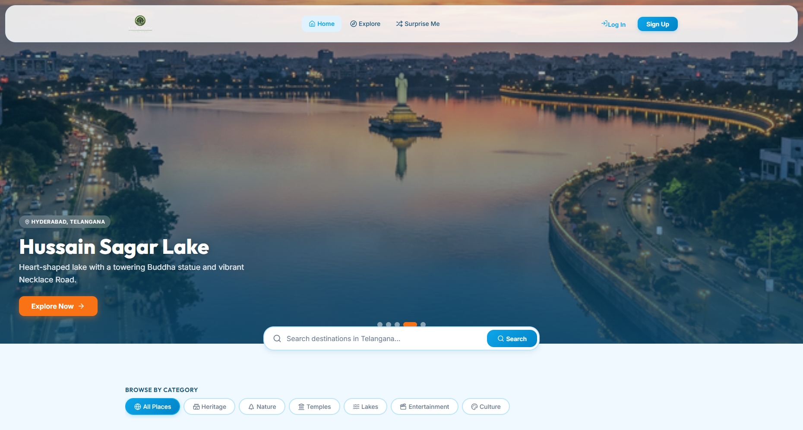
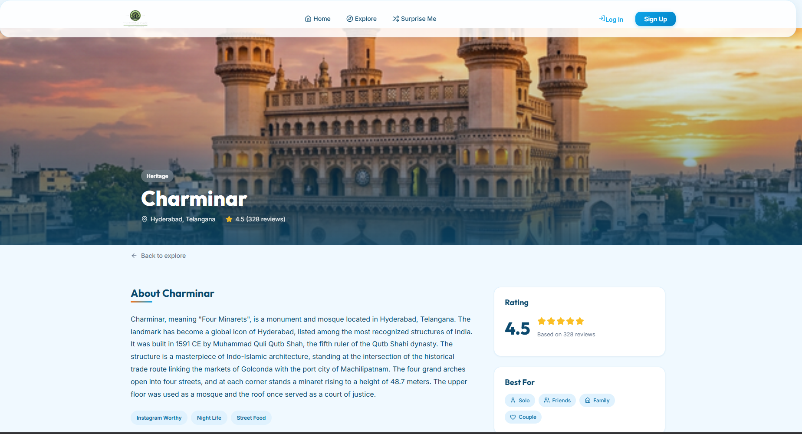
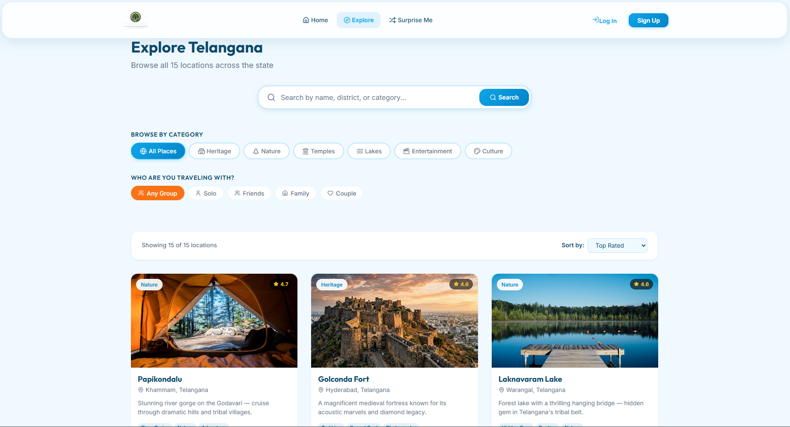

<p align="center">
  
</p>

<h1 align="center">🌳 THE REM OAK</h1>

<p align="center">
  <strong>Discover the Hidden Gems of Telangana</strong><br/>
  A modern, crowdsourced travel discovery platform that goes beyond tourist hotspots to spotlight authentic destinations, promote sustainable tourism, and empower community-driven exploration across Telangana.
</p>

<p align="center">
  <a href="#-features">Features</a> •
  <a href="#-tech-stack">Tech Stack</a> •
  <a href="#-getting-started">Getting Started</a> •
  <a href="#-project-structure">Project Structure</a> •
  <a href="#-database-schema">Database</a> •
  <a href="#-contributing">Contributing</a> •
  <a href="#-license">License</a>
</p>

<p align="center">
  
  
  
  
  
</p>

---

## 📸 Screenshots

> Add your own screenshots here after deploying! Recommended sizes: **1280×720** for desktop, **375×812** for mobile.

| Home Page | Location Detail | Explore |
|:-:|:-:|:-:|
|  |  |  |

---

## ✨ Features

### 🧭 Discover & Explore
- Browse **15+ curated hidden gems** across 10+ districts of Telangana
- Rich location pages with descriptions, photo galleries, visitor info, and tags
- **"Surprise Me"** button — get a random destination picked for your next adventure

### 🔍 Smart Search & Filtering
- Real-time search bar with instant suggestions
- Filter by **category** — Heritage, Nature, Temples, Lakes, Entertainment, Culture
- Filter by **group type** — Solo, Friends, Family, Couple

### 🗺️ Interactive Maps
- Embedded **Leaflet** maps on every location detail page
- Pinpoint exact coordinates with custom markers

### ✍️ Community Reviews
- Read and write reviews for any destination
- **Star ratings** (1–5) with text comments
- **Photo uploads** stored in Supabase Storage
- Sample reviews as fallback when the database is empty

### 🔐 Authentication
- Secure **email/password** sign-up and login powered by Supabase Auth
- User profile management with display names
- Protected actions (review submission) for authenticated users only

### 🎨 Premium Design
- Hand-crafted **CSS design system** with custom properties (no utility frameworks)
- Smooth **hero slideshow** with Swiper.js
- Fully **responsive** — optimized for desktop, tablet, and mobile
- Dark, modern aesthetic with glassmorphism touches and micro-animations

---

## 🛠️ Tech Stack

| Layer | Technology |
|:--|:--|
| **Framework** | [React 19](https://react.dev/) with [Vite 8](https://vite.dev/) |
| **Routing** | [React Router DOM v7](https://reactrouter.com/) |
| **Backend & Auth** | [Supabase](https://supabase.com/) (PostgreSQL, Auth, Storage) |
| **Maps** | [Leaflet](https://leafletjs.com/) + [React-Leaflet](https://react-leaflet.js.org/) |
| **Carousels** | [Swiper.js](https://swiperjs.com/) |
| **Icons** | [Lucide React](https://lucide.dev/) |
| **Styling** | Vanilla CSS with custom design system (CSS Variables) |
| **Linting** | ESLint 9 with React Hooks & Refresh plugins |

---

## 🚀 Getting Started

### Prerequisites

- **Node.js** v18 or higher
- **npm** (comes with Node.js)
- A free [Supabase](https://supabase.com/) account

### 1. Clone the Repository

```bash
git clone https://github.com/Owais010/The-Rem-Oak.git
cd The-Rem-Oak
```

### 2. Install Dependencies

```bash
npm install
```

### 3. Set Up Supabase

1. Create a new project in your [Supabase Dashboard](https://supabase.com/dashboard)
2. Open the **SQL Editor**
3. Paste the entire contents of [`supabase-schema.sql`](supabase-schema.sql) and click **Run**

This will automatically:
- Create the `locations`, `reviews`, and `user_profiles` tables
- Enable **Row Level Security (RLS)** with appropriate policies
- Set up the `review-images` storage bucket with public read access
- Create optimized indexes for search and filtering

### 4. Configure Environment Variables

Create a `.env` file in the project root:

```env
VITE_SUPABASE_URL=https://your-project.supabase.co
VITE_SUPABASE_ANON_KEY=your-anon-key-here
```

> You can find these values in your Supabase Dashboard under **Settings → API**.

### 5. Start the Dev Server

```bash
npm run dev
```

Open [https://theremoak.vercel.app/](https://theremoak.vercel.app/) in your browser. 🎉

### Other Scripts

| Command | Description |
|:--|:--|
| `npm run dev` | Start development server with HMR |
| `npm run build` | Build for production |
| `npm run preview` | Preview the production build locally |
| `npm run lint` | Run ESLint checks |

---

## 📁 Project Structure

```
The-Rem-Oak/
├── public/
│   ├── favicon.svg              # App favicon
│   ├── icons.svg                # SVG icon sprite
│   └── images/                  # Static location images
│       ├── charminar.jpg
│       ├── golconda.jpg
│       ├── hussain-sagar.jpg
│       ├── ramoji.jpg
│       ├── thousand-pillar.jpg
│       └── warangal-fort.jpg
├── src/
│   ├── components/              # Reusable UI components
│   │   ├── AuthModal.jsx        # Login/Signup modal
│   │   ├── CategoryFilter.jsx   # Category & group type filters
│   │   ├── Footer.jsx           # Site footer
│   │   ├── HeroSlideshow.jsx    # Hero banner carousel (Swiper)
│   │   ├── InfoModal.jsx        # Information popup modal
│   │   ├── LocationCard.jsx     # Location preview card
│   │   ├── MapView.jsx          # Leaflet interactive map
│   │   ├── Navbar.jsx           # Navigation bar
│   │   ├── RandomPicker.jsx     # "Surprise Me" random destination
│   │   ├── ReviewCard.jsx       # Individual review display
│   │   ├── ReviewForm.jsx       # Write a review form
│   │   ├── SearchBar.jsx        # Search with suggestions
│   │   └── StarRating.jsx       # Star rating display
│   ├── context/
│   │   └── AuthContext.jsx      # Auth state management (React Context)
│   ├── lib/
│   │   ├── locations-seed.js    # 15 curated locations data + categories
│   │   └── supabase.js          # Supabase client initialization
│   ├── pages/
│   │   ├── Home.jsx             # Landing page
│   │   ├── AllLocations.jsx     # Explore all locations page
│   │   └── LocationDetail.jsx   # Individual location page
│   ├── App.jsx                  # App root with routing
│   ├── main.jsx                 # Entry point
│   └── index.css                # Global design system & variables
├── supabase-schema.sql          # Database schema (tables, RLS, storage)
├── .env.example                 # Environment variable template
├── vite.config.js               # Vite configuration
├── eslint.config.js             # ESLint configuration
└── package.json
```

---

## 🗄️ Database Schema

The app uses **Supabase** (PostgreSQL) with three core tables:

```mermaid
erDiagram
    LOCATIONS ||--o{ REVIEWS : has_many
    AUTH_USERS ||--o{ REVIEWS : writes
    AUTH_USERS ||--|| USER_PROFILES : has_one

    LOCATIONS {
        string id PK
        string name
        string slug
        string category
        string genre
        string group_type
        float latitude
        float longitude
        string district
        string image_url
        float rating
        int review_count
        boolean is_featured
    }

    REVIEWS {
        string id PK
        string location_id FK
        string user_id FK
        string user_name
        int rating
        string comment
        string images
        string created_at
    }

    USER_PROFILES {
        string id PK
        string display_name
        string avatar_url
        string created_at
    }
    REVIEWS {
        uuid id PK
        text location_id FK
        uuid user_id FK
        text user_name
        int2 rating
        text comment
        text[] images
        timestamptz created_at
    }

    USER_PROFILES {
        uuid id PK_FK
        text display_name
        text avatar_url
        timestamptz created_at
    }
```

**Security**: All tables have [Row Level Security (RLS)](https://supabase.com/docs/guides/auth/row-level-security) enabled — locations are publicly readable; reviews can be created/edited/deleted only by their author; profiles are publicly readable but only self-editable.

---

## 🤝 Contributing

Contributions are what make the open-source community an amazing place to learn, inspire, and create. Any contributions you make are **greatly appreciated**!

1. **Fork** the repository
2. **Create** your feature branch
   ```bash
   git checkout -b feature/amazing-feature
   ```
3. **Commit** your changes
   ```bash
   git commit -m "feat: add amazing feature"
   ```
4. **Push** to your branch
   ```bash
   git push origin feature/amazing-feature
   ```
5. **Open** a Pull Request

### Ideas for Contributions

- 🌍 Add more hidden gem locations across Telangana
- 🌐 Multi-language support (Telugu, Hindi, Urdu)
- 📊 Analytics dashboard for location popularity
- 🧳 Trip planner / itinerary builder
- 📱 PWA support for offline access
- 🗺️ Route planning between locations

---

## 📜 License

Distributed under the **MIT License**. See [`LICENSE`](LICENSE) for more information.

---

<p align="center">
  Made with ❤️ for Telangana
  <br/>
  <a href="https://github.com/Owais010/The-Rem-Oak">⭐ Star this repo if you found it helpful!</a>
</p>
